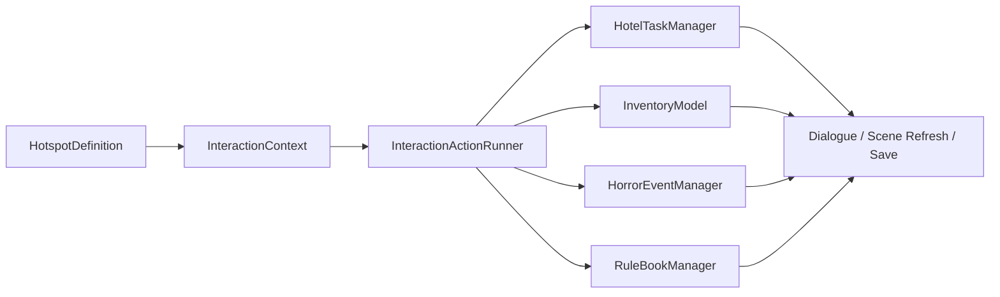

# Gameplay Systems Design

This document defines the next architecture step for hotel duties, item use, rule-book-driven anomaly resolution, and future room expansion.

The target is not to remove Godot editor authoring. The target is to make editor-authored hotspots call a small, stable set of data-driven gameplay systems instead of adding more one-off branches to `scripts/main.gd`.

## 한국어 요약

다음 구현의 핵심은 `main.gd`에 기능을 계속 박지 않는 것이다. Godot에서 클릭 영역을 편집하는 방식은 유지하되, 클릭했을 때 실행되는 행동은 `InteractionActionRunner`가 처리하게 만든다.

권장 순서:

1. `InteractionActionRunner`를 만들고 현재 action 문자열 처리를 옮긴다.
2. `FlagStore`를 추가해서 세탁기 열림/닫힘 같은 작은 상태를 한곳에서 저장한다.
3. `HotelTaskManager`를 추가해서 이불 개기, 바닥 닦기, 쓰레기 줍기 같은 호텔 업무를 `pending → done` 상태로 관리한다.
4. 장착한 `Hand` 아이템을 hotspot에 사용할 수 있게 만든다.
5. Rule Book을 단순 텍스트가 아니라 `rule_id`, 태그, 관련 이상현상/아이템을 가진 데이터로 바꾼다.
6. 이상현상 해결 조건을 아이템, 룰북, 업무 완료 조건과 연결한다.

즉, 앞으로 컨텐츠를 추가할 때는 `main.gd` 분기를 늘리는 대신 다음 형태로 추가한다:

- 방/사진/이동: scene catalog와 Godot hotspot
- 일반 업무: `HotelTaskDefinition`
- 아이템: `HotelItemDefinition`
- 아이템 조합: `HotelItemCombinationRule`
- 룰북 규칙: `HotelRuleDefinition`
- 이상현상/점프스케어: `HotelHorrorEventDefinition`
- 클릭 실행: `InteractionActionRunner`

첫 실제 구현은 `InteractionActionRunner`부터 하는 것이 가장 안전하다. 이걸 먼저 해야 호텔 업무, 아이템 사용, 이상현상 제거를 같은 방식으로 확장할 수 있다.

## Design Goals

- Keep photo and hotspot editing comfortable in Godot.
- Keep gameplay rules editable from focused GDScript data objects instead of one large script.
- Support ordinary hotel work and horror anomalies through the same interaction pipeline.
- Allow every room group to share state across its multiple photo angles.
- Track discovered and resolved anomaly history for the lobby collection.
- Preserve web-export-friendly UI and GDScript-only implementation.

## Current Pressure Points

- `scripts/main.gd` owns scene data, hotspot action dispatch, laundry state, dialogue feedback, save capture, and anomaly hooks.
- Hotspot actions are currently string branches such as `toggle_laundry_washer`, `resolve_horror_event:<id>`, and `trigger_jumpscare:<id>`.
- Inventory supports item-to-item combination, but item-to-hotspot use is not modeled yet.
- Rule Book text is localized UI only. It does not yet expose rule ids, tags, or gameplay conditions.
- Hotel chores do not have a lifecycle. Future chores such as folded bedding, cleaned stains, and collected trash need persistent state.

## Target Runtime Flow



Hotspot clicks should eventually flow through one runner:

1. Build an `InteractionContext`.
2. Check hotspot visibility and enabled conditions.
3. Execute one or more action definitions.
4. Emit result events such as scene changed, item gained, task completed, anomaly resolved, or dialogue requested.
5. Save current day state after meaningful changes.

## Core Classes

### `HotelInteractionActionRunner`

Owns action dispatch. `main.gd` should call this instead of parsing every action itself.

Responsibilities:

- Parse action dictionaries and legacy action strings.
- Execute common action types.
- Return an `InteractionResult` rather than directly mutating all UI.
- Keep legacy action strings working during migration.

Initial action types:

```gdscript
{"type": "show_dialogue", "text_key": "hotspot.room_105.bed.default", "fallback_text": "The sheets are loose."}
{"type": "go_to_scene", "target_scene_id": "corridor"}
{"type": "add_item", "item_id": "trash_bag"}
{"type": "complete_task", "task_id": "room_105_fold_bed"}
{"type": "use_equipped_item_on_task", "task_id": "room_105_clean_stain"}
{"type": "resolve_horror_event", "event_id": "room_105_shadow_stain"}
{"type": "trigger_jumpscare", "event_id": "room_108_light_repair_call"}
{"type": "set_flag", "flag_id": "laundry.second_washer.open", "value": false}
```

Legacy support:

- `toggle_laundry_washer`
- `resolve_horror_event:<id>`
- `trigger_jumpscare:<id>`

### `HotelInteractionContext`

Small object created per click or item use.

Fields:

- `scene_id`
- `room_id`
- `hotspot_id`
- `equipped_item_id`
- `day`
- `horror_event_id`
- `flags`

This keeps action code testable without needing to inspect the whole scene tree.

### `HotelInteractionResult`

Returned by the runner.

Fields:

- `changed_scene_id`
- `dialogue_key`
- `fallback_dialogue`
- `transient_dialogue`
- `persistent_dialogue`
- `should_refresh_hotspots`
- `should_refresh_photo`
- `should_save`
- `blocked_reason_key`
- `fallback_blocked_reason`

`main.gd` only applies these result fields to UI.

### `HotelTaskDefinition`

Data object for ordinary hotel duties.

Fields:

- `id`
- `room_id`
- `scene_ids`
- `hotspot_id`
- `task_type`
- `required_item_id`
- `state_flag_id`
- `completion_action_ids`
- `fallback_title`
- `fallback_description`
- `fallback_done_text`

Example task types:

- `fold_bedding`
- `clean_stain`
- `collect_trash`
- `inspect_guest_item`
- `close_object`
- `repair_object`

Example:

```gdscript
var task := HotelTaskDefinition.new()
task.id = "room_105_fold_bed"
task.room_id = "room_105"
task.scene_ids = ["room_105_door_window"]
task.hotspot_id = "room_105_bed"
task.task_type = "fold_bedding"
task.state_flag_id = "task.room_105.fold_bed.done"
task.fallback_title = "Fold Bedding"
task.fallback_description = "The blanket is messy."
task.fallback_done_text = "The blanket is folded into a stiff square."
```

### `HotelTaskManager`

Owns ordinary hotel work state.

Responsibilities:

- Register task definitions.
- Track task states: `hidden`, `pending`, `done`, `failed`.
- Expose task-driven hotspot overlays or state changes.
- Complete tasks through generic actions.
- Export/import save state.

Minimal API:

```gdscript
func register_definition(definition) -> void
func get_tasks_for_scene(scene_id: String) -> Array
func get_task_state(task_id: String) -> String
func complete_task(task_id: String) -> bool
func can_use_item(task_id: String, item_id: String) -> bool
func export_state() -> Dictionary
func import_state(state: Dictionary) -> void
```

### `HotelRuleDefinition`

Rule Book should become structured data, not just text lines.

Fields:

- `id`
- `order`
- `text_key`
- `fallback_text`
- `tags`
- `related_task_ids`
- `related_horror_event_ids`
- `related_item_ids`
- `unlock_flag_id`

Examples:

- `rule.stop_red_washer`
- `rule.knock_before_vacant_open_room`
- `rule.remove_black_mold`
- `rule.do_not_return_revealed_note_after_midnight`

The UI can still render a simple localized list, but systems can query rule ids and tags.

### `HotelRuleBookManager`

Owns rule definitions and read state.

Responsibilities:

- Return visible rules in order.
- Mark rules as read when opened or inspected.
- Let anomalies require a specific rule to be read before resolution.
- Export/import read/unlocked state.

Minimal API:

```gdscript
func get_visible_rules() -> Array
func mark_rule_read(rule_id: String) -> void
func has_read_rule(rule_id: String) -> bool
func export_state() -> Dictionary
func import_state(state: Dictionary) -> void
```

### `HotelFlagStore`

Shared boolean/string/number state store for small facts that do not deserve a custom manager.

Examples:

- `laundry.second_washer.open`
- `task.room_105.fold_bed.done`
- `anomaly.room_105.shadow_stain.visible`
- `rule.remove_black_mold.read`

This prevents every new feature from adding a new top-level variable to `main.gd`.

Minimal API:

```gdscript
func set_value(flag_id: String, value) -> void
func get_value(flag_id: String, fallback = null)
func has(flag_id: String) -> bool
func erase(flag_id: String) -> void
func export_state() -> Dictionary
func import_state(state: Dictionary) -> void
```

## Hotspot Data Shape

Godot editor hotspots should keep the current fields and gain optional structured fields over time.

Current fields:

- `hotspot_id`
- `hotspot_label`
- `target_scene_id`
- `description_text`
- `action`

Future fields:

- `actions: Array[Dictionary]`
- `required_flag_id`
- `blocked_text_key`
- `fallback_blocked_text`
- `usable_item_ids`
- `task_id`
- `horror_event_id`

The migration should not require immediately editing every hotspot. Runtime can convert legacy fields:

- `target_scene_id` → `{"type": "go_to_scene"}`
- `description_text` → `{"type": "show_dialogue"}`
- `action` → runner legacy adapter

## Item-To-Hotspot Use

The equipped `Hand` item should be considered when a hotspot is clicked.

Recommended behavior:

1. If no item is equipped, run the hotspot's normal click actions.
2. If an item is equipped and hotspot has item-use rules, run the matching item action.
3. If an item is equipped but there is no matching rule, show a short failure dialogue.

Example:

```gdscript
{
	"id": "room_105_floor_stain",
	"label": "Stain",
	"rect": Rect2(0.420, 0.680, 0.180, 0.120),
	"task_id": "room_105_clean_floor_stain",
	"item_actions": [
		{
			"item_id": "cleaning_cloth",
			"actions": [
				{"type": "complete_task", "task_id": "room_105_clean_floor_stain"},
				{"type": "show_dialogue", "fallback_text": "The stain wipes away, but the cloth smells wrong."}
			]
		}
	]
}
```

This keeps inventory equipment, chores, and anomaly resolution on the same path.

## Anomaly Resolution Model

`HotelHorrorEventDefinition` should gain explicit resolution data.

Suggested fields:

- `required_item_id`
- `required_rule_id`
- `required_task_id`
- `resolution_actions`
- `failure_text_key`
- `fallback_failure_text`
- `resolved_text_key`
- `fallback_resolved_text`

Examples:

- Visual stain anomaly: requires `cleaning_cloth`.
- Wrong room number anomaly: requires reading a rule and comparing room log.
- Washer anomaly: requires closing washer after a rule is visible.
- Jump scare: blocks pause/menu until animation finishes, then either continues or returns to lobby.

Important invariant:

- Discovery and collection tracking are separate from resolution. A player can discover an anomaly, fail to resolve it, leave, and still see it in the lobby collection.

## Save Data Shape

Current day save should evolve to:

```gdscript
{
	"scene_id": current_scene_id,
	"flags": flag_store.export_state(),
	"inventory": inventory_model.export_state(),
	"tasks": task_manager.export_state(),
	"horror": horror_event_manager.export_state(),
	"rules": rule_book_manager.export_state(),
	"game_brightness": game_brightness
}
```

Migration rule:

- Keep reading old fields such as `laundry_second_washer_open` until at least one save format bump.
- New systems should export under their own keys.

## Room Expansion Workflow

When adding a room:

1. Add photos under `resource/images/`.
2. Add scene ids and photo paths to the scene catalog.
3. Add all scene ids to one room group in `HotelHorrorRoomRegistry`.
4. Add hotspot nodes under `HotspotDefinitions/<scene_id>` in `scenes/main.tscn`.
5. Add room-specific tasks to `HotelTaskCatalog`.
6. Add room-specific anomalies to `HotelHorrorCatalog`.
7. Add localized labels only when player-facing text differs from fallback.

This keeps “one room with multiple views” explicit and prevents anomalies from duplicating across angles.

## Implementation Plan

### Phase 1: Interaction Runner

- Add `scripts/interactions/interaction_context.gd`.
- Add `scripts/interactions/interaction_result.gd`.
- Add `scripts/interactions/interaction_action_runner.gd`.
- Move `_run_hotspot_action()` branches into the runner.
- Keep `main.gd` as UI coordinator only.
- Add tests for legacy action compatibility.

Exit criteria:

- Laundry toggle, anomaly resolve, jumpscare trigger, movement, and dialogue still work.
- New action dictionaries work without adding more `main.gd` branches.

### Phase 2: Flag Store

- Add `scripts/systems/flag_store.gd`.
- Move laundry washer state into flags.
- Keep old save import fallback.
- Use flags for hotspot visibility and task state.

Exit criteria:

- The washer still toggles and saves.
- Adding a new boolean state does not require a new `main.gd` member variable.

### Phase 3: Hotel Task System

- Add `scripts/tasks/task_definition.gd`.
- Add `scripts/tasks/task_catalog.gd`.
- Add `scripts/tasks/task_manager.gd`.
- Implement one sample task each:
  - fold bedding
  - clean floor stain
  - collect trash

Exit criteria:

- Each sample task can be completed through hotspot interaction.
- Task completion persists in save data.
- Completed task can change hotspot text or hide a hotspot.

### Phase 4: Item-To-Hotspot Use

- Add item-use action matching to the interaction runner.
- Let equipped `Hand` item affect clicked hotspots.
- Add a cleaning item sample.

Exit criteria:

- Clicking a floor stain with no item gives normal/failure text.
- Clicking it with cleaning item completes the task.
- Item-to-item combination remains unchanged.

### Phase 5: Rule Book Data

- Add `scripts/rules/rule_definition.gd`.
- Add `scripts/rules/rule_book_manager.gd`.
- Move Rule Book entries into a catalog with ids and tags.
- Keep current localized rendering.

Exit criteria:

- Rule Book UI still shows the same rules.
- Rules can be referenced by anomalies and tasks.
- Read/unlocked state can be saved.

### Phase 6: Anomaly Resolution Conditions

- Extend horror definitions with resolution conditions.
- Route anomaly hotspot clicks through the interaction runner.
- Add one item-resolved anomaly and one rule-resolved anomaly.

Exit criteria:

- An anomaly can require a rule or item.
- Failed resolution gives dialogue and keeps the anomaly active.
- Successful resolution updates collection state and room hotspots.

## Coding Boundaries

- Do not put new gameplay branches directly into `main.gd` unless they are temporary compatibility adapters.
- Prefer catalogs for content and managers for state.
- Keep UI classes free of gameplay decisions.
- Keep GDScript data objects copyable where runtime mutation is possible.
- Preserve editor-authored hotspot editing.
- Use save import fallback whenever replacing an existing state key.

## First Practical Slice

The first implementation slice should be:

1. Add `HotelInteractionActionRunner`.
2. Move current `_run_hotspot_action()` behavior into it.
3. Keep old action strings supported.
4. Add dictionary action support.
5. Convert one simple hotspot to dictionary action as proof.

This gives a safe base before adding chores, item-to-hotspot use, and rule-driven anomaly fixes.

## Implementation Status

Implemented foundation:

- `HotelInteractionActionRunner` executes legacy string actions and new dictionary actions.
- `HotelFlagStore` stores small persistent state, including `laundry.second_washer.open`.
- `HotelTaskDefinition`, `HotelTaskCatalog`, and `HotelTaskManager` support ordinary hotel duties.
- `HotelRuleDefinition`, `HotelRuleBookCatalog`, and `HotelRuleBookManager` provide structured Rule Book ids and read state.
- `HotelInventoryModel` can export/import inventory state.
- `scripts/main.gd` now routes hotspot clicks through the interaction runner and saves `flags`, `inventory`, `tasks`, `horror`, and `rules`.

Current sample duties:

- Room 105 bedding can be folded by clicking the bedding task hotspot.
- Room 105 bathroom sink stain requires the equipped `cleaning_cloth`.
- Room 107 loose papers can be collected and create `collected_trash`.

Still intentionally open for later content work:

- More room-specific task catalogs.
- Rule-specific anomaly resolution conditions.
- Visual photo variants for completed chores.
- Godot editor exports for structured action arrays and item action arrays.
