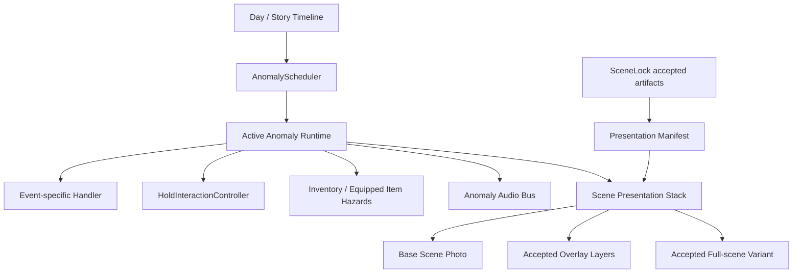

# 이상현상 런타임 설계

## 목표

확정 이상현상을 하나씩 하드코딩하지 않고 다음 요구를 공통 시스템으로 만족한다.

- 활성 이상현상은 호텔 전체에서 항상 최대 1개다.
- 기현상과 엔티티는 같은 스케줄러를 사용하되 위험과 해결 절차는 분리한다.
- 마우스 홀드, Hand 아이템 홀드, 눈 감기와 노래를 같은 진행 상태 모델로 표시한다.
- 이미지가 교체되어도 이벤트 로직, 핫스폿과 저장 데이터는 유지된다.
- SceneLock 결과물은 승인된 자산 경로만 바꾸며 게임 코드를 수정하지 않는다.
- 처리 중 정답·오사용 메시지를 띄우지 않는다. 명시적으로 확정된 사건 대사만 예외다.

## 현재 코드에서 유지할 것과 바꿀 것

### 유지

- `HotelSceneCatalog`: 안정적인 `scene_id`와 기본 사진 경로
- `HotelHotspotArea`: Godot 에디터에서 조정하는 정규화 핫스폿
- `HotelInteractionActionRunner`: 범용 액션 실행과 결과 반환
- `HotelInventoryModel`: 인벤토리와 Hand 상태
- `HotelEyeCloseController`: 실눈 시야와 노래 상태
- `HotelHorrorEventManager`: 발견 기록, 컬렉션과 점프스케어 진입점
- `HotelDaySaveManager`: Day별 저장 경계

### 단계적으로 교체

- `HotelNightAnomalyDirector` 안의 전화·세탁기·아이별 타이머를 개별 런타임 컴포넌트로 분리한다.
- `HotelHorrorEventManager.active_event_id_by_room` 방식은 전역 `active_anomaly_id`를 가진 스케줄러 아래로 내린다.
- `main.gd`에서 직접 분기하는 옷장, 세탁기, 아이 처리를 공통 액션과 이벤트 핸들러로 이동한다.
- `room_109_overlay`, `anomaly_visual_overlay`, `scene_3d_overlay`처럼 흩어진 화면 합성을 하나의 프레젠테이션 레이어 스택으로 수렴한다.

현재 디렉터는 Day가 높아지면 전화, 세탁기와 아이의 타이머를 각각 진행할 수 있다. 이는 정사의 동시 발생 금지와 충돌하므로 콘텐츠를 추가하기 전에 스케줄러를 먼저 교체해야 한다.

## 권장 구조



### `AnomalyScheduler`

공통 코어는 `scripts/horror/anomaly_scheduler.gd`에 구현한다. 이 코어는 콘텐츠 타이머를 직접 알지 않고 active ID, 우선순위 queue, conflict defer, cooldown과 save/import만 책임진다. 기존 `NightAnomalyDirector`는 한 번에 교체하지 않고 사건별 handler adapter를 통해 순차적으로 이전한다.

전역 상태:

- `active_anomaly_id`
- `pending_anomaly_queue`
- `inter_anomaly_cooldown`
- `current_day`
- `safe_until_timestamp`

상태 전이:

```text
idle -> queued -> active -> resolving -> cooldown -> idle
                         \-> fatal
```

규칙:

- `active_anomaly_id`가 비어 있을 때만 대기열 첫 사건을 시작한다.
- 신규 Day 고정 사건이 재등장 기현상보다 우선한다.
- 활성 사건의 전용 소리와 타이머가 정리된 뒤에만 cooldown으로 이동한다.
- 다른 사건 때문에 조건을 만족하지 못한 사건은 폐기하지 않고 대기열에 유지한다.
- `conflict_tags`가 현재 Day의 동선 금지 상태와 겹치면 시작을 미룬다.

### `AnomalyDefinition`

게임플레이 정의에 필요한 필드:

```text
id
kind: phenomenon | entity | item_hazard
min_day
scene_ids
fixed_story_day
recurrence_policy
conflict_tags
rule_ids
initial_state
state_handler_id
presentation_manifest_path
audio_manifest_path
neglect_timeout_key
fatal_event_id
```

정확한 초, 반복 간격과 확률은 정의에 숫자로 박지 않고 tuning key로 참조한다. 그래야 공포 연출과 이미지 상태를 바꾸지 않고 난이도만 조정할 수 있다.

### 사건별 Handler

공통 시스템이 억지로 모든 기믹을 데이터 표현식으로 만들지 않는다. 다음처럼 고유 규칙이 있는 사건은 작은 handler 클래스를 가진다.

- 벨 빠른 3연타 두 묶음
- 샤워 커튼 3~5회
- 아기 얼굴 다섯 면 비트 마스크
- 90초 최초 대기와 45초·30초의 옷장 2단계
- 세탁기 정지·음악·눈 감은 폐기
- 등록되지 않은 아이의 노래와 안기

handler는 프레젠테이션 노드를 직접 만지지 않고 상태 변경 이벤트만 낸다.

```text
state_changed(event_id, state_id)
progress_changed(event_id, progress)
audio_requested(cue_id)
resolved(event_id)
fatal_requested(fatal_event_id)
```

이벤트별 handler를 허용하는 이유는 복잡한 범용 조건 언어를 만드는 것보다 변형과 테스트가 쉽기 때문이다.

## 진행 바

공통 상태기는 `scripts/interactions/hold_interaction_controller.gd`에 둔다.

### 원형

- 마우스로 화면 대상을 누르고 유지
- Hand 아이템을 장착하고 `F`를 누르고 유지
- 커서 주변 표시
- 대상에서 커서가 벗어나거나 입력을 놓으면 이벤트 정책에 따라 초기화 또는 일시정지

### 가로형

- 눈 감기 유지
- 노래 부르기 유지
- 이불 속 아이 앞에서 버티기
- 화면 하단 표시

진행 바 완료는 시각·음향 상태를 바꾸지만 일반 완료 메시지를 만들지 않는다.

## 상호작용 경로

일반 클릭과 아이템 사용은 분리한다.

```text
mouse click -> execute_hotspot
F with Hand -> execute_item_on_hotspot
```

- 일반 클릭은 Hand에 무엇이 있든 일반 행동을 실행한다.
- `F` 사용에 맞는 `item_action`이 없으면 아무 일도 일어나지 않는다.
- 오사용 경고와 `"That does not work here"` 메시지를 표시하지 않는다.
- 무도구 처리 기현상은 Hand 상태를 검사하지 않는 `hold_hotspot`이다.

현재 코드에는 이 분리가 반영되어 있다.

## 아이템

### 확정 신규 아이템

| ID | 표시 이름 | 초기 지급 | 용도 |
| --- | --- | --- | --- |
| `small_mirror` | 작은 거울 | 획득처 확정 전까지 아니오 | 끔찍한 화장실 거울의 형상을 받음 |
| `hell_mirror` | 지옥의 거울 | 직접 지급하지 않음 | `small_mirror`가 변한 위험 상태 |

`replace_item` 액션으로 같은 인벤토리 슬롯의 아이템을 교체하고 `equip_replacement=true`로 즉시 Hand에 장착한다.

### 장착 아이템 위험

별도 `EquippedItemHazardController`를 추가한다.

필드:

```text
item_id
timeout_tuning_key
unequip_policy: reset | pause | accumulate
loop_audio_cue
fatal_event_id
```

`지옥의 거울`은 `unequip_policy=reset`으로 운용한다. Hand 장착 중에만 12초 타이머가 진행되고 내려놓으면 초기화되며, 메뉴가 게임을 pause하면 타이머도 멈춘다. 세탁실의 두 번째 세탁기가 유일한 폐기 지점이고, 근무 종료 때 아이템이 남아 있으면 즉시 fatal로 연결한다.

## 프레젠테이션 레이어

각 장면은 다음 순서로 렌더링한다.

1. 기본 사진
2. 구조 변경이 필요한 full-scene variant
3. 원본 크기 투명 PNG 오버레이
4. 절차형 마스크·깜빡임·VHS
5. 눈 감기 마스크
6. 점프스케어
7. HUD와 진행 바

오버레이는 잘라낸 작은 이미지가 아니라 기본 사진과 같은 캔버스 크기의 투명 PNG를 권장한다. 위치를 코드로 재조정할 필요가 없고 SceneLock 결과 교체가 안전하다.

프레젠테이션 매니페스트 예시:

```json
{
  "schema_version": 1,
  "event_id": "front_desk_monitor_ghost",
  "source_scene_id": "front_desk",
  "source_sha256": "...",
  "states": {
    "active": {
      "layers": [
        {
          "slot": "monitor_ghost",
          "path": "res://resource/images/anomalies/front_desk_monitor_ghost/active.png",
          "sha256": "...",
          "z_index": 20
        }
      ]
    }
  }
}
```

경로와 해시는 SceneLock 결과를 승인한 뒤에만 채운다. 예정 파일을 가리키거나 빈 이미지를 정상 자산처럼 등록하지 않는다.

## 음향

전용 `Anomaly` 오디오 버스를 추가한다.

- 활성 사건 시작 시 해당 사건 cue만 등록한다.
- 사건 해결·사망·Day 종료 시 loop와 예약된 one-shot을 모두 중단한다.
- 전역 경고음은 장면 전환에도 유지한다.
- 위치 단서는 필요한 사건만 2D 위치감을 사용한다.
- 한 이상현상 최대 1개 규칙 덕분에 전화벨, 웃음, 울음과 완료 음악이 겹치지 않아야 한다.
- 각 외부 음원은 `resource/sounds/licenses/`에 출처·라이선스를 기록한다.

## 저장

저장할 상태:

```text
active_anomaly_id
pending_anomaly_queue
inter_anomaly_cooldown
event state_id
event persistent counters and masks
neglect time remaining
item ids and equipped item id
equipped-item hazard elapsed time if policy is accumulate
accepted presentation manifest version
```

마우스를 누르고 있던 순간의 진행 바는 저장하지 않는다. 로드하면 안전하게 0에서 다시 시작한다. 반면 옷장 단계와 남은 대기, 벨 단계, 아기 얼굴 면 마스크와 샤워 커튼 필요 반복 횟수는 저장한다.

## 마이그레이션 순서

1. 공통 hold 상태기와 진행 바 UI를 연결한다.
2. 일반 클릭과 Hand 사용 분리를 유지한다.
3. `AnomalyScheduler`를 추가하고 기존 디렉터를 adapter로 감싼다.
4. 전화 이벤트 하나를 handler로 이전해 active 1개 불변식을 검증한다.
5. 세탁기와 아이를 순서대로 이전한다.
6. 기현상 handler와 프레젠테이션 매니페스트 로더를 추가한다.
7. 옷장의 돼지 가면 남자와 전역 울음 주기를 스케줄러에 연결한다.
8. 기존 `NightAnomalyDirector`의 하드코딩 상태를 제거한다.

## 필수 테스트

- 서로 다른 사건 10개를 enqueue해도 active는 항상 1개
- 해결 전에는 다음 사건 타이머가 진행되지 않음
- 사건 해결 후 모든 loop audio가 정지
- 잘못된 Hand 아이템 사용은 dialogue와 blocked reason을 만들지 않음
- 무도구 hold는 Hand 아이템 종류와 무관
- `small_mirror` 교체 후 동일 슬롯의 `hell_mirror`가 자동 장착
- 저장·로드 후 아기 얼굴 비트 마스크와 커튼 반복 목표가 보존
- SceneLock 자산의 SHA-256 또는 크기가 매니페스트와 다르면 개발 빌드에서 명시적 오류
